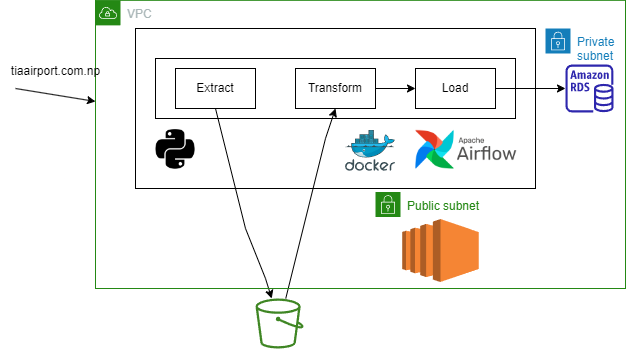
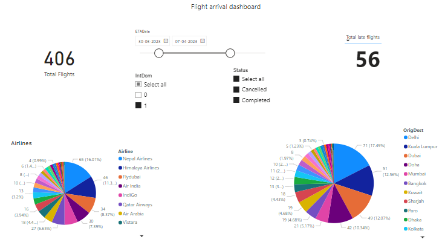

# TIA ETL Pipeline

A ETL pipeline that extract Flight data from Tribhuvan International Airport.

# Architecture

1) Data is extracted from [tia](https://tiairport.com.np/)
2) Load to s3
3) Transform the data
4) Load the data in RDS
   
# Dashboard

# How to use?

1) Set the values inside `.env` and `terraform/variables.tf`
2) `cd terraform`
3) `terraform init .`
4) `terraform apply`
5) Now you can see `ec2 ip` and `rds endpoint` in terminal
6) `terraform output private_key` and copy the rsa key into `tia_key.pem` in project root directory
7) `cd ..`
8) `chmod 400 tia_key.pem` 
9)  Connect to the ec2 instance using `ssh -i tia_key.pem {user_name}@{ec2_ip}` 
    > Note: If you use default ami your user_name will be ubuntu
10)  `sudo snap install docker` to install docker in ec2
11)  Username and password used by airflow and local postgres server are hardcoded in `docker-compose.yaml`
12)  Copy all files and folders to ec2 except terraform
13)  `docker-compose build`
14)  `docker-compose up`
   
Now docker container will run and data will be extracted every 30 minutes and stored in RDS.

> Note: RDS can only be accessed using above ec2 instance

## To stop
1) `docker-compose down`
2) To remove all the services in aws `terrafrom destroy`

# Why this architecture?

I used docker and ec2 in this pipeline to learn about them. One can simply run this pipeline by removing docker and airflow in lambda. Using lambda will be quick and cost effictive.
